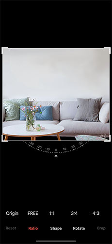
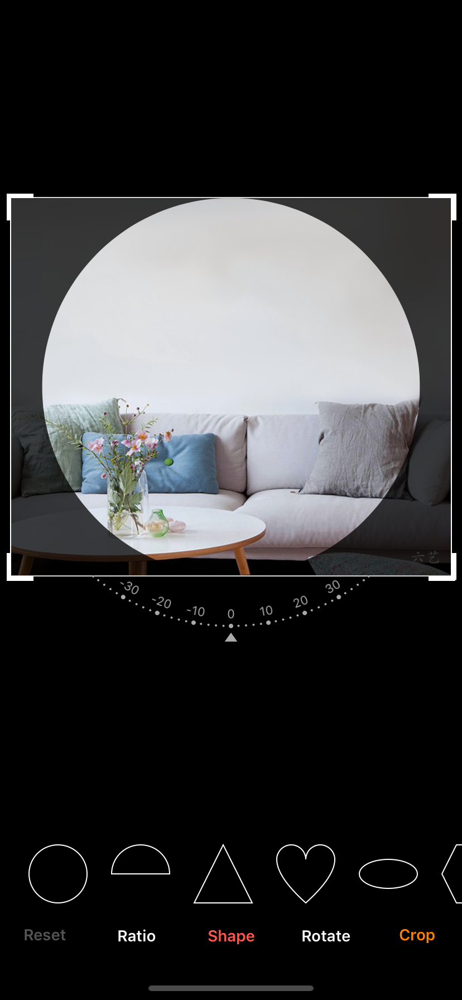
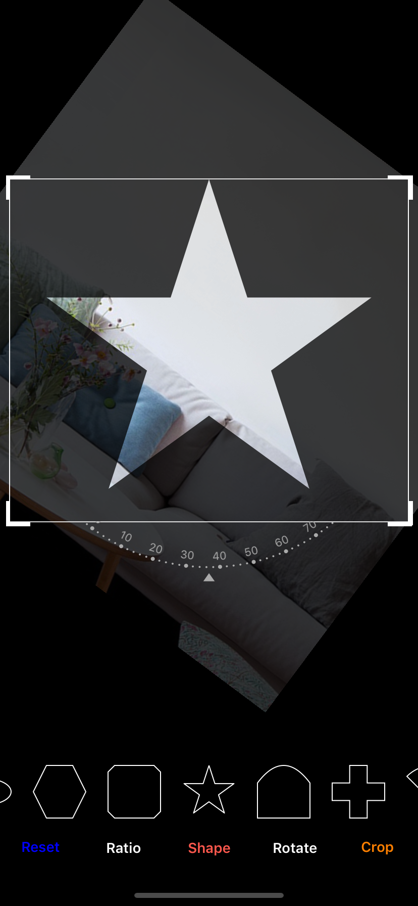

# CHWImageEditorView

[](https://travis-ci.org/JackyHeWei/CHWImageEditorView)
[](https://cocoapods.org/pods/CHWImageEditorView)
[](https://cocoapods.org/pods/CHWImageEditorView)
[](https://cocoapods.org/pods/CHWImageEditorView)

 
 
 
 
 

## Example
You can use the CHWCropRotateView in your project, how to use the CHWCropRotateView ,you can find the detail in my example project.


    CropRotateConfig* config = [CropRotateConfig new];// the default config, you can create your config model.
    CHWCropRotateView* cropRotateView = [[CHWCropRotateView alloc] initWithImage:image withConfig:config];
    cropRotateView.frame = CGRectMake(0, 0, CGRectGetWidth(self.view.bounds), CGRectGetHeight(self.view.bounds)-TABBARHEIGHT-60-60);
    cropRotateView.forceFixedRatio = NO;
    cropRotateView.delegate = self;
    [self.view addSubview:cropRotateView];
    
    

To run the example project, clone the repo, and run `pod install` from the Example directory first.

## Requirements

## Installation

CHWImageEditorView is available through [CocoaPods](https://cocoapods.org). To install
it, simply add the following line to your Podfile:

```ruby
pod 'CHWImageEditorView'
```

## Author

JackyHeWei, Cherish_wei_he@163.com

## License

CHWImageEditorView is available under the MIT license. See the LICENSE file for more info.
